# TUGAS 4

Nama : Karmila Novi Arfiana

Kelas : TI 3C / 09

NIM : 2041720073

## Langkah-langkah praktikum

### Uji Coba PySpark
Menjalankan service dari pyspark terlebih dahulu dengan perintah 

<code>cd spark-2.0.0-bin-hadoop2.7</code>

<code>bin/pyspark</code>

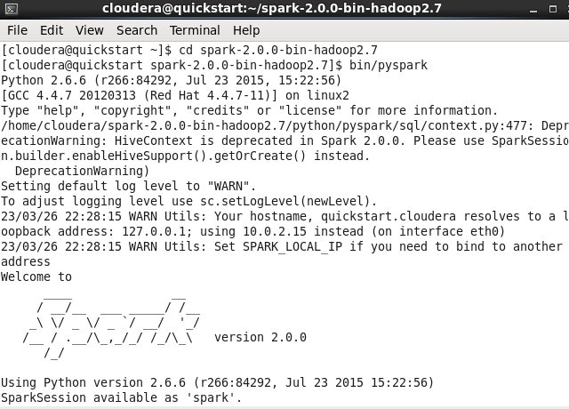

1. Uji coba  <code> Accumulator.py </code>  
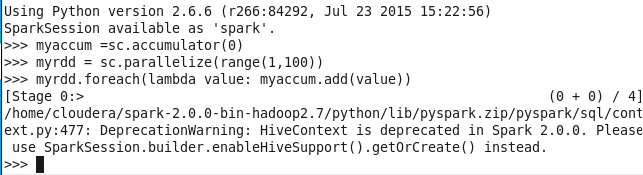  

sc: singkatan dari SparkContext, ini adalah objek utama dalam pemrograman dengan Apache Spark. Ini digunakan untuk menginisialisasi aplikasi Spark dan membuat RDD (Resilient Distributed Datasets) yang mendukung komputasi paralel.

accumulator: objek shared variable yang digunakan dalam Apache Spark untuk agregasi asinkron nilai dari beberapa executor (pekerja) di sepanjang sebuah job (tugas). Biasanya digunakan untuk menghitung statistik yang kompleks atau mengakumulasikan hasil dalam loop.

parallelize: method yang digunakan pada objek SparkContext untuk membuat RDD dari koleksi data yang ada dalam program. RDD ini nantinya akan didistribusikan secara paralel pada executor (pekerja) yang tersedia.

lambda: fungsi anonim yang sering digunakan dalam pemrograman fungsional dan pemrograman paralel. Biasanya digunakan untuk melakukan operasi yang sederhana dan terbatas pada sebuah data, sehingga sangat cocok untuk dijalankan di dalam RDD.

value: sebuah metode pada tipe data dictionary dalam bahasa pemrograman Python yang mengembalikan sebuah nilai (value) dalam dictionary tersebut.

2. Uji coba <code> BroadCast.py </code>  
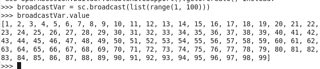  

broadcast: sebuah fungsi dalam Spark yang digunakan untuk mendistribusikan variabel secara efisien ke setiap node dalam sebuah cluster, sehingga setiap node dapat mengakses variabel tersebut dengan cepat tanpa perlu menyalinnya berkali-kali.

list: tipe data yang umum digunakan dalam bahasa pemrograman Python untuk menyimpan sejumlah nilai dalam satu variabel. List dapat berisi elemen-elemen dengan tipe data yang berbeda, dan dapat diakses menggunakan indeks.

range: sebuah fungsi dalam bahasa pemrograman Python yang digunakan untuk menghasilkan deret bilangan bulat secara berurutan, dengan argumen yang dapat ditentukan untuk memulai, mengakhiri, dan menentukan langkah antar bilangan. Deret bilangan ini berguna dalam banyak skenario pemrograman, seperti pengulangan for-loop.

3. Uji coba <code> LogAnalytics.py </code>  
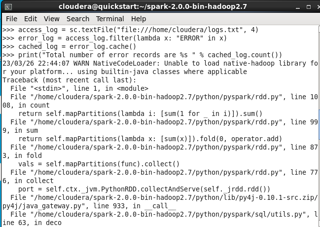  
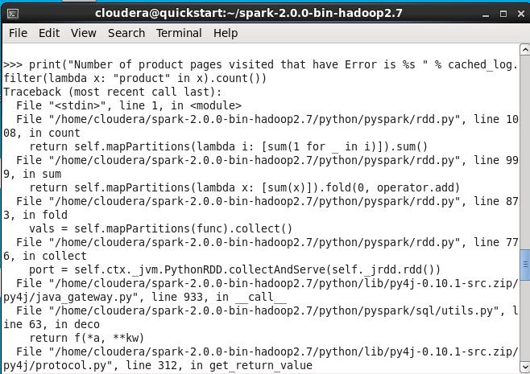  

textFile: sebuah fungsi dalam Spark yang digunakan untuk membaca file teks dan mengembalikan RDD (Resilient Distributed Datasets) yang berisi baris-baris dalam file tersebut sebagai elemen-elemennya.

filter: sebuah fungsi dalam Spark yang digunakan untuk memfilter elemen-elemen dalam RDD berdasarkan kondisi tertentu. Fungsi ini mengembalikan RDD yang hanya berisi elemen-elemen yang memenuhi kondisi tersebut.

cache: sebuah metode dalam Spark yang digunakan untuk menyimpan RDD di dalam memori cache. Hal ini dapat meningkatkan performa komputasi karena RDD yang sering digunakan dapat diakses dengan lebih cepat daripada membacanya dari disk.

count: sebuah fungsi dalam Spark yang digunakan untuk menghitung jumlah elemen dalam sebuah RDD dan mengembalikan hasilnya sebagai bilangan bulat.

4. Uji coba <code> PairRDD.py </code>  
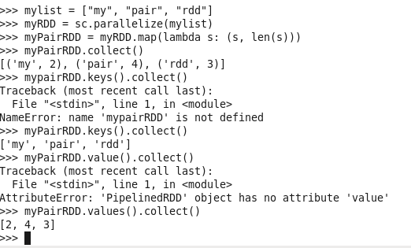  

map: sebuah fungsi dalam Spark yang digunakan untuk melakukan transformasi pada setiap elemen dalam RDD dengan menggunakan sebuah fungsi yang diberikan sebagai argumen. Fungsi ini mengembalikan RDD baru yang berisi hasil transformasi tersebut.

len: sebuah fungsi dalam bahasa pemrograman Python yang digunakan untuk menghitung jumlah elemen dalam sebuah list atau tipe data lain yang dapat dihitung panjangnya.

collect: sebuah fungsi dalam Spark yang digunakan untuk mengambil semua elemen dalam sebuah RDD dan mengembalikan hasilnya sebagai list pada driver program. Fungsi ini tidak disarankan digunakan pada RDD yang sangat besar, karena dapat mengakibatkan out-of-memory error.

keys: sebuah metode pada tipe data dictionary dalam bahasa pemrograman Python yang mengembalikan sebuah list yang berisi semua kunci (keys) dalam dictionary tersebut.

values: sebuah metode pada tipe data dictionary dalam bahasa pemrograman Python yang mengembalikan sebuah list yang berisi semua nilai (values) dalam dictionary tersebut.

5. Uji coba <code> UnderstandingRDD.py </code>  
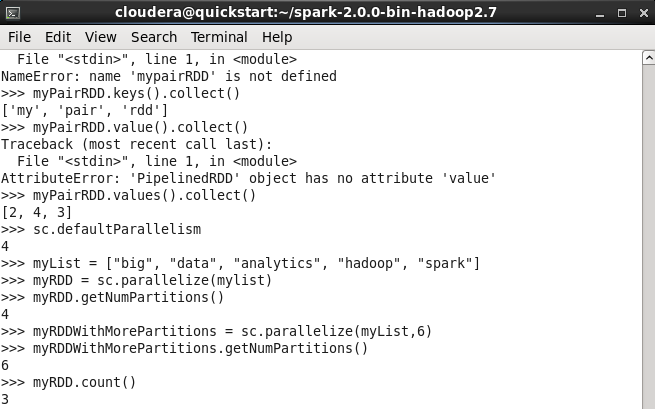  
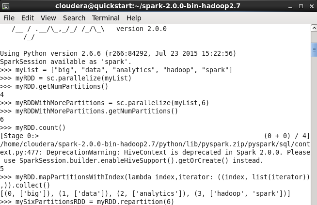  
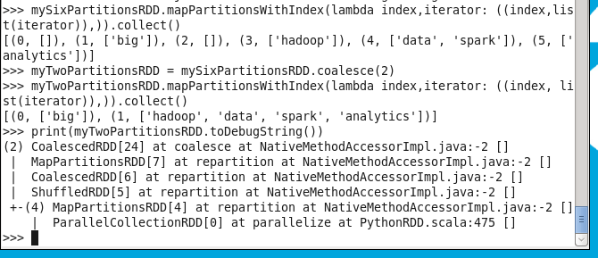  

defaultParallelism: sebuah atribut dalam Spark yang menentukan jumlah partisi yang digunakan secara default saat membuat RDD baru. Nilai defaultnya adalah jumlah core yang tersedia di cluster.

getNumPartitions: sebuah metode dalam Spark yang digunakan untuk mengambil jumlah partisi dalam sebuah RDD.

mapPartitionsWithIndex: sebuah fungsi dalam Spark yang mirip dengan fungsi map, namun berbeda dalam cara penggunaannya. Fungsi ini memungkinkan pengguna untuk mengakses indeks partisi RDD saat melakukan transformasi pada setiap partisinya.

repartition: sebuah fungsi dalam Spark yang digunakan untuk mengubah jumlah partisi sebuah RDD menjadi jumlah yang diinginkan. Fungsi ini dapat menyebabkan pengiriman data melintasi jaringan dan dapat memakan waktu yang lama.

coalesce: sebuah fungsi dalam Spark yang digunakan untuk menggabungkan beberapa partisi dalam sebuah RDD menjadi satu partisi. Fungsi ini lebih efisien daripada repartition, karena tidak menyebabkan pengiriman data melintasi jaringan.

toDebugString: sebuah metode dalam Spark yang digunakan untuk mengambil string representasi dari RDD yang berisi informasi tentang partisi-partisi dalam RDD, lokasi masing-masing partisi, dan transformasi yang telah dilakukan pada RDD tersebut.

6. Uji coba <code> WordCount.py </code>  
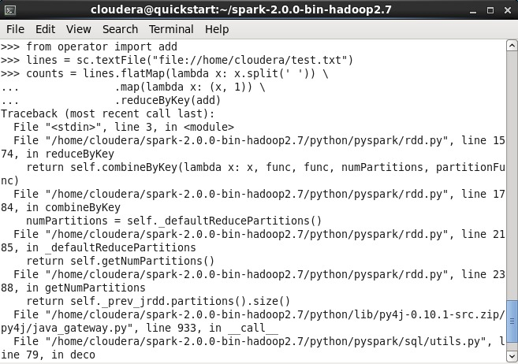  
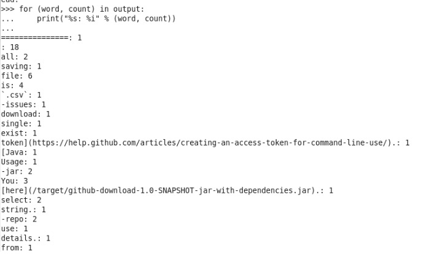  

flatMap: sebuah fungsi dalam Spark yang mirip dengan fungsi map, namun berbeda dalam cara penggunaannya. Fungsi ini digunakan untuk menghasilkan nol atau lebih elemen dari setiap elemen dalam RDD yang diberikan sebagai argumen. Fungsi ini mengembalikan RDD baru yang berisi semua elemen yang dihasilkan.

reduceByKey: sebuah fungsi dalam Spark yang digunakan untuk menghitung agregasi nilai pada tiap kunci (key) dalam sebuah RDD. Fungsi ini mengelompokkan elemen berdasarkan kunci yang sama, dan menggabungkan nilai-nilai untuk setiap kunci menggunakan sebuah fungsi agregasi tertentu. Hasilnya adalah RDD baru yang berisi setiap kunci dengan nilai agregasi yang sesuai.

split: sebuah fungsi dalam bahasa pemrograman Python yang digunakan untuk membagi sebuah string menjadi beberapa substring berdasarkan sebuah karakter pemisah (separator). Fungsi ini mengembalikan sebuah list dari substring-substring tersebut.

### Uji Coba Scala
Menjalankan service dari sparkshell terlebih dahulu dengan perintah
<code>cd spark-2.0.0-bin-hadoop2.7</code>

<code>bin/spark-shell</code>

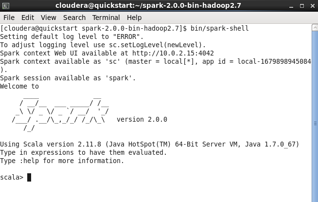  

Jalankan juga service cloudera manager dengan perintah:  

<code> sudo /home/cloudera/cloudera-manager --express --force </code>
kemudian login pada browser. Setelah itu, jalankan service HDFS

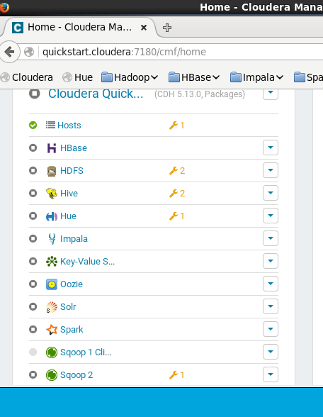  

1. Uji coba <code> SystemCommandsOutput.scala </code>  
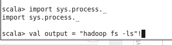  
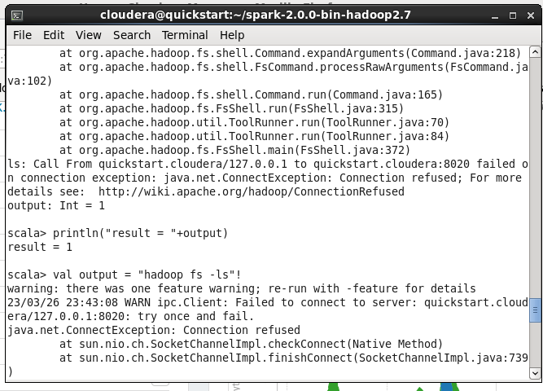  

2. Uji coba <code> SystemCommandsReturnCode.scala </code>
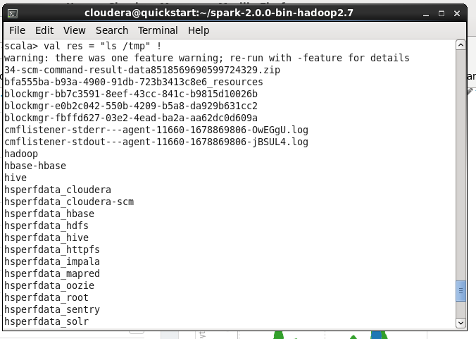  
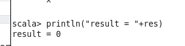  
Sukses menampilkan list file pada folder /tmp (temporary file)

## TUGAS 2

Jelaskan masing-masing maksud kode berikut sesuai nomor kode.

### Kode 1 sc, accumulator, parallelize, lambda, value

1. sc = sc adalah singkatan dari SparkContext, yang merupakan gateway/gerbang utama untuk fungsionalitas Spark.

2. accumulator = adalah variabel yang dapat diakses oleh semua pekerja dalam cluster dan digunakan untuk mengakumulasikan hasil dari operator paralel

3. parallelize = adalah metode SparkContext yang digunakan untuk membuat RDD (Resilient Distributed Dataset) dari kumpulan data pengontrol aplikasi. Metode paralel membagi pengumpulan data menjadi beberapa bagian (sections) dan secara otomatis mendistribusikannya ke node pekerja cluster, yang memungkinkan proses perhitungan paralel untuk setiap node pekerja.

4. lamda = adalah fungsi anonim dari bahasa pemrograman Python yang digunakan untuk mengubah data menggunakan RDD (Resilient Distributed Dataset) di Spark. Lambda mengurangi penulisan kode yang berlebihan dan mempercepat proses pemrograman.

5. value = merupakan kumpulan data yang dapat dibagi menjadi beberapa bagian (section) dan didistribusikan ke beberapa node cluster, yang memungkinkan proses komputasi paralel pada setiap node 

### Kode 2 broadcast, list, range

1. Broadcast = Broadcast adalah variabel adalah variabel read-only bersama yang di-cache dan tersedia di semua node dalam sebuah cluster untuk mengakses atau digunakan oleh tugas-tugas

2. list = list adalah struktur data dalam Python yang menampung kumpulan/tupel item. Daftar item diapit tanda kurung siku, seperti [data1, data2, data3].

3. range = Buat RDD baru dari int yang berisi elemen dari awal hingga akhir (eksklusif), tingkatkan setiap elemen secara bertahap. Dapat dipanggil dengan cara yang sama seperti fungsi range() bawaan python. Jika dipanggil dengan satu argumen, argumen tersebut ditafsirkan sebagai akhir, dan mulai diatur ke 0.

### kode 3 textFile, filter, cache, count

1. textfile= adalah salah satu metode yang digunakan untuk membaca file teks di Spark dan mengubahnya menjadi RDD (Resilient Distributed Dataset).

2. filter = adalah salah satu operasi transformasi Resilient Distributed Dataset (RDD) yang digunakan untuk memfilter item RDD berdasarkan kondisi yang diberikan.

3. cache= adalah salah satu metode yang digunakan untuk menyimpan RDD (Resilient Distributed Dataset) dalam memori node cluster.
Teknik ini memungkinkan RDD, yang sering digunakan dalam operasi dan fungsi konversi, untuk disimpan dalam memori, sehingga mengurangi waktu yang diperlukan untuk memproses RDD.

4. count = adalah fungsi yang digunakan untuk menghitung jumlah elemen dalam Resilient Distributed Dataset (RDD). Fungsi ini mengembalikan bilangan bulat yang mewakili jumlah elemen di RDD. 

### Kode 4 map, collect, len, keys, values

1. map = map adalah fungsi di Spark yang digunakan untuk melakukan transformasi pada setiap elemen RDD menggunakan fungsi yang diberikan sebagai argumen. Fungsi ini mengembalikan RDD baru yang berisi hasil transformasi.

2. collect = collect adalah fungsi di Spark yang digunakan untuk mengambil semua elemen RDD dan mengembalikan hasilnya sebagai daftar di program driver. Fungsi ini tidak disarankan untuk RDD yang sangat besar karena dapat menyebabkan kerusakan memori.

3. len = len adalah fungsi bahasa pemrograman Python yang digunakan untuk menghitung jumlah elemen dalam daftar atau tipe data lain yang panjangnya dapat dihitung. keys = keys adalah metode kamus data dalam bahasa pemrograman Python yang mengembalikan daftar yang berisi semua kunci dalam kamus.

5. value = value adalah metode mirip kamus dalam bahasa pemrograman Python yang mengembalikan daftar yang berisi semua value dalam kamus. 

### Kode 5 defaultParallelism, getNumPartitions, mapPartitionsWithIndex, repartition, coalesce, toDebugString

1. defaultParallelism = adalah pengaturan yang menentukan jumlah partisi default yang akan dibuat saat membuat Resilient Distributed Dataset (RDD) baru di Spark.

2. getNumPartitions = adalah fungsi di Spark yang digunakan untuk mendapatkan jumlah partisi dari RDD (Resilient Distributed Dataset) yang dibuat di Spark.
Fungsi GetNumPartitions() tidak memerlukan argumen dan mengembalikan nilai bilangan bulat yang mewakili jumlah partisi RDD. 3. mapPartitionsWithIndex = adalah fungsi Spark yang memungkinkan pengguna melakukan pemrosesan pada setiap partisi dari Resilient Distributed Dataset (RDD) yang memiliki akses ke indeks partisi. Fungsi ini menerima sebagai argumen sebuah fungsi untuk diterapkan ke setiap partisi RDD, fungsi ini menerima dua argumen, yaitu indeks partisi dan iterator yang berisi semua elemen dari partisi tersebut.

4. coalesce = adalah fungsi Spark yang digunakan untuk memindahkan data secara acak dari satu partisi ke partisi lainnya, memungkinkan pengguna mengatur ulang disk RDD dan meningkatkan beban pada cluster Spark. 5. Merge = adalah fungsi Spark yang digunakan untuk mengurangi jumlah partisi RDD (Resilient Distributed Dataset) menjadi nilai yang lebih kecil. Fitur ini sangat berguna untuk mengurangi overhead cluster Spark dan meningkatkan kinerja operasi RDD.

6. toDebugString = adalah fungsi Spark yang digunakan untuk menampilkan informasi detail tentang RDD (Resilient Distributed Dataset) di log. Fitur ini berguna untuk memudahkan penggunaan Spark untuk men-debug dan menyetel pengoperasian RDD. 

### Kode 6 flatMap, reduceByKey, split

1. flatMap = flatMap adalah fungsi di Spark yang mirip dengan fungsi peta tetapi berbeda dalam penggunaannya. Fungsi ini digunakan untuk mengembalikan nol atau lebih elemen dari setiap elemen RDD yang diberikan sebagai argumen. Fungsi ini mengembalikan RDD baru yang berisi semua item yang dibuat.

2. reductionByKey = reductionByKey adalah fungsi di Spark yang digunakan untuk menghitung jumlah nilai dari setiap kunci di RDD. Fungsi ini mengelompokkan item berdasarkan kunci yang sama dan menggabungkan nilai untuk setiap kunci menggunakan fungsi agregat tertentu. Hasilnya adalah RDD baru yang berisi setiap kunci dengan nilai total yang sesuai.

3. split = split adalah fungsi bahasa pemrograman Python yang digunakan untuk membagi string menjadi beberapa substring berdasarkan pembatas. Fungsi ini mengembalikan daftar substring tersebut. 
